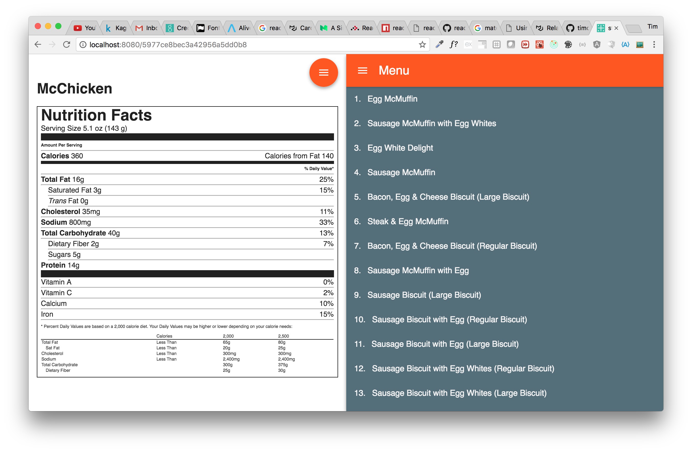

# Nutrition Coding Challenge

The package.json is right now in develop version, and the "dependencies" will be defined after production is tested (moving only those needed ones from devDependencies to dependencies).

To make the response data more self explained, the "Item" info is returned also along with "Total Fat" and
"Trans Fat" for matching specified parameters (as express query in req.query). For query of collection, query "skip" and "limit" is supported, so that pagination is supported easier.

The restful query can be using any schema key, such as "Item", "Category", "Calories", "Total Fat", or "Total Fat (% Daily Value)" to enhance better query. 

React frontend is added so that one can browse the database on the single page application.

# Frontend Stack

The frontend is mainly comprise of react, redux, and webpack, material-ui, plus others. Few component is connected to a specific store. Most of react components are function component for speed. There is one Top container component. The reducer, action, and dispatch is written very differently from typical redux guideline. It is because class/object orient programming makes organizing redux's various parts easier.

# Backend Stack
The backend is mainly comprised of node, express, mongo, plus various other, like babel, moment, commander, and body-parser. Also, async/await is added with babel to make server handling async easier.

## Menu Item Keys
Each menu item has the following keys, which can be used in API query, such as GET /mcdonalds?select=Calories&select=Trans+Fat&select=Item to get first 5 menu items and show their Item, Calories, and Trans Fat  
1. Category
1. Item
1. Serving Size
1. Calories
1. Calories from Fat
1. Total Fat
1. Total Fat (% Daily Value)
1. Saturated Fat
1. Saturated Fat (% Daily Value)
1. Trans Fat
1. Cholesterol
1. Cholesterol (% Daily Value)
1. Sodium
1. Sodium (% Daily Value)
1. Carbohydrates
1. Carbohydrates (% Daily Value)
1. Dietary Fiber
1. Dietary Fiber (% Daily Value)
1. Sugars
1. Protein
1. Vitamin A (% Daily Value)
1. Vitamin C (% Daily Value)
1. Calcium (% Daily Value)
1. Iron (% Daily Value)

where Category must be one of the following:  
1. Breakfast
1. Beef & Pork
1. Chicken & Fish
1. Salads
1. Snacks & Sides
1. Desserts
1. Beverages
1. Coffee & Tea
1. Smoothies & Shakes

## Task 1: import nutrition menu for mcdonalds in csv format to mongodb.

1. open https://www.kaggle.com/mcdonalds/nutrition-facts
1. sign up, and down csv file from (menu.csv into mcdonalds.csv)
1. 'npm run mongo_import'

## Task 2: create node/express/mongo server

1. start up your mongo server (docker run mongo for example)
1. 'npm run build_host' to build host.js from server.js6 with babel (1st time)
1. 'npm run watch_host' to run host.js node/express/mongo
1. 'curl GET http://localhost:8080/mcdonalds'  
   curl -X GET 'localhost:8080/mcdonalds?Total+Fat=1'
1. 'curl POST http://localhost:8080/mcdonalds'  
   where all the info must be presented to be able to save. see below for more info.

## APIs

### GET /mcdonalds?skip=0&limit=5&select=key1&select=key2...
get a list of mcdonalds menu items and allow pagination with skip, limit, and select. (no sorting order, but it will be similar to select, for example order=Category&order=Total+Fat&order=Item)

1. GET /mcdonalds  
   is the same as  
   GET /mcdonalds?select=Item&select=Total+Fat&select=Trans+Fat&skip=0&limit=5
1. GET /mcdonalds?select=Item&select='Total Fat'&select='Trans Fat'  
   is the same as  
   GET /mcdonalds
1. GET /mcdonalds?select=*  
   is the same as  
   GET /mcdonalds?select=Item&select=Category&select=Serving+Size&select=Calories&select=...&select=Total+Fat&select=Trans+Fat&skip=0&limit=5
1. GET /mcdonalds?select=Item  
   returns first 5 items with just the Item and _id.

### GET /mcdonalds/:id?select=key1&select=key2...
get one mcdonalds menu item, using mongo _id. 
It supports select query arguments as above. However skip and limit are not applicable.

1. GET /mcdonalds/5977ce8bec3a42956a5dd079
   return one item with three keys: Item, Total Fat, Trans Fat.

1. GET /mcdonalds/5977ce8bec3a42956a5dd079?select=*
   return one item with all keys

### POST /mcdonalds
create a mcdonalds menu item and must satisfy the above menu keys and category

1. POST /mcdonalds  
   curl -H "Content-Type: application/json" -X POST http://localhost:8080/mcdonalds 
   -d '{ "Category" : "Breakfast", "Item" : "Thin Film Muffin", "Serving Size" : "0.001 oz (0.1 g)",
	"Calories" : 1,	"Calories from Fat" : 1, "Total Fat" : 1, "Total Fat (% Daily Value)" : 1,
	"Saturated Fat" : 1, "Saturated Fat (% Daily Value)" : 1, "Trans Fat" : 1, "Cholesterol" : 1,
	"Cholesterol (% Daily Value)" : 1, "Sodium" : 1, "Sodium (% Daily Value)" : 1, "Carbohydrates" : 1,
	"Carbohydrates (% Daily Value)" : 1, "Dietary Fiber" : 1, "Dietary Fiber (% Daily Value)" : 1,
	"Sugars" : 1, "Protein" : 1, "Vitamin A (% Daily Value)" : 1, "Vitamin C (% Daily Value)" : 1,
	"Calcium (% Daily Value)" : 1, "Iron (% Daily Value)" : 1 }'
